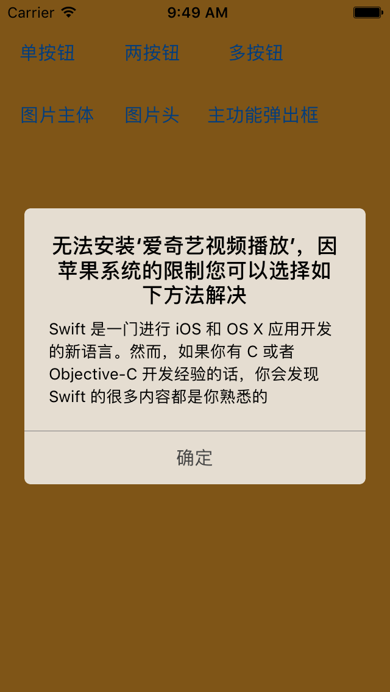
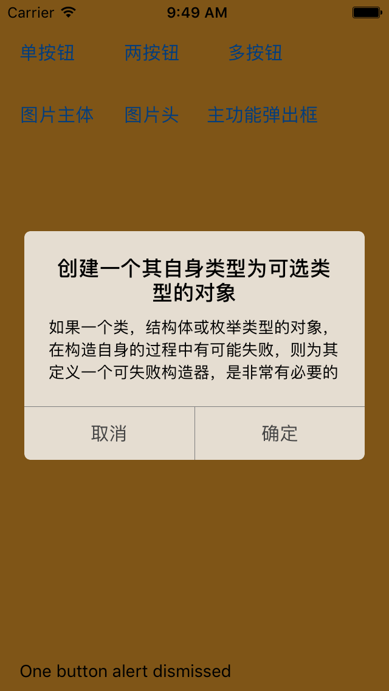
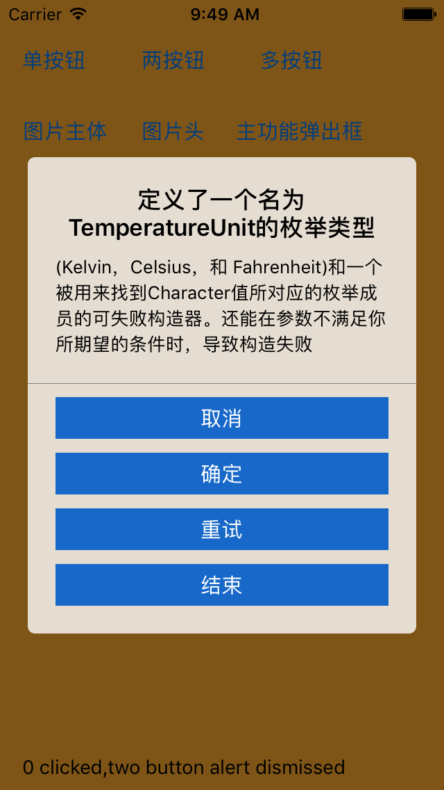
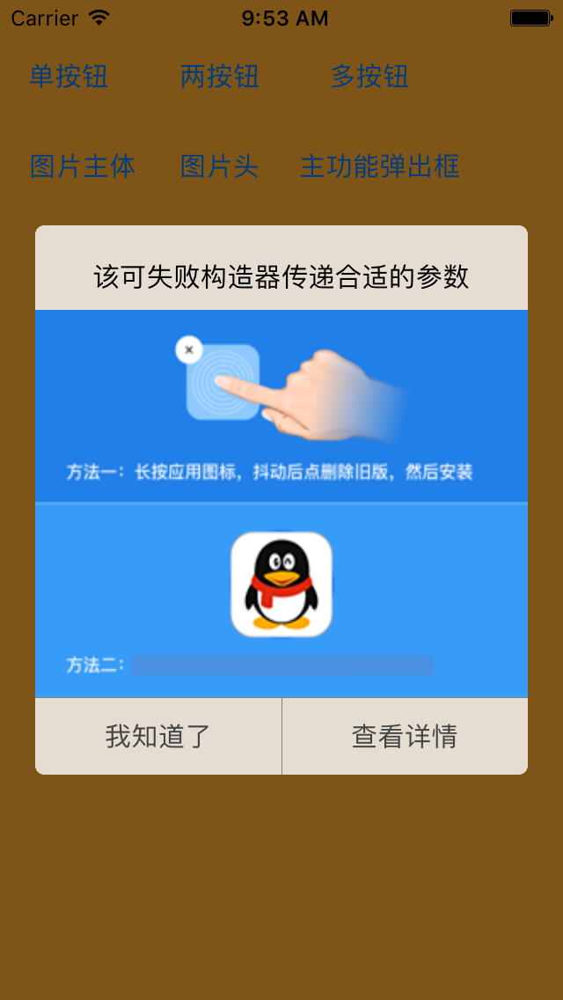
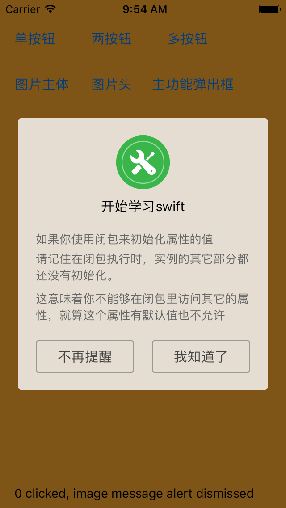
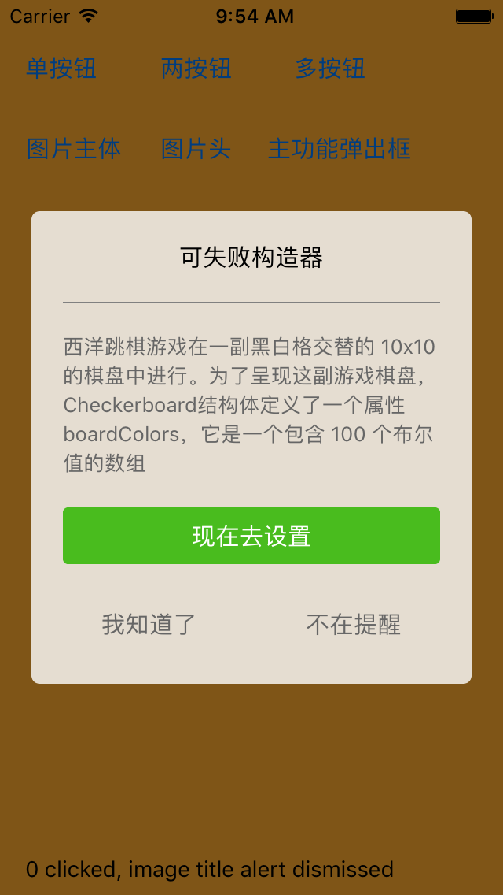
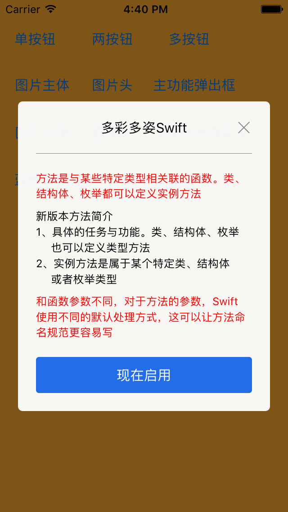
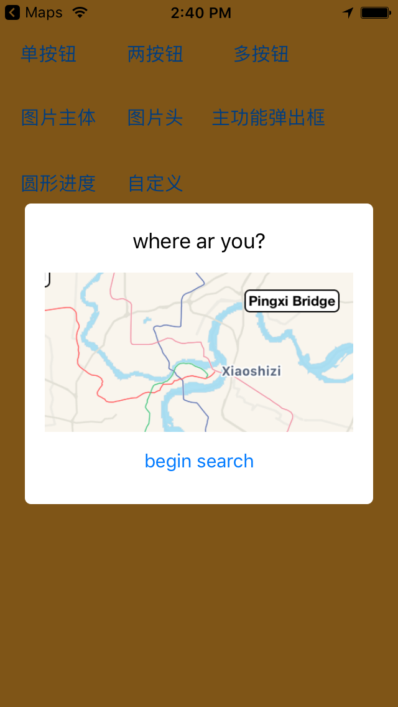
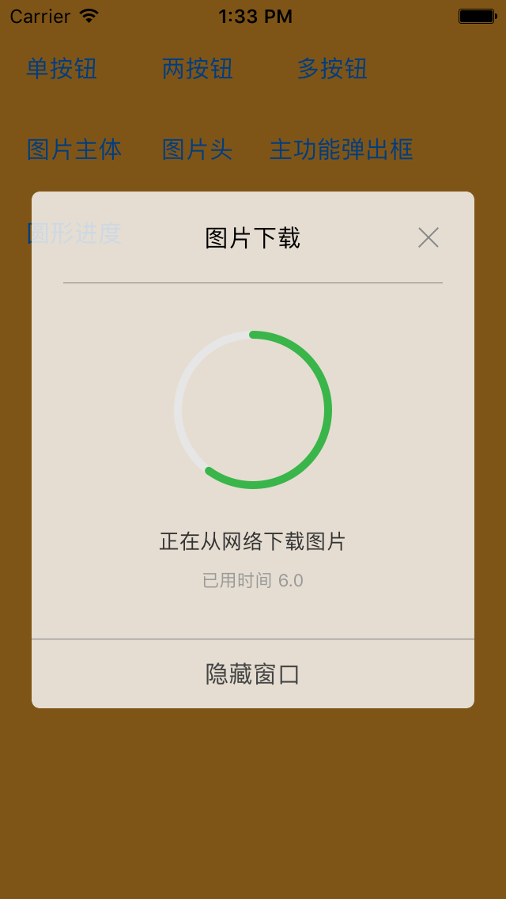

# CKAlertView

[](https://travis-ci.org/kaich/CKAlertView)
[](http://cocoapods.org/pods/CKAlertView)
[](http://cocoapods.org/pods/CKAlertView)
[](http://cocoapods.org/pods/CKAlertView)

## Usage

简单的使用方式，调用如下方式代码就可以显示你要的弹出框,具体用法参考`Example`

	let alert = CKAlertView(title: "无法安装‘爱奇艺视频播放’，因苹果系统的限制您可以选择如下方法解决", message: ["Swift 是一门进行iOS新语言"], cancelButtonTitle: "确定", otherButtonTitles: nil){ index in
            self.lblMessage.text = "One button alert dismissed"
        }
        alert.show()


## Alert Style

提供多种样式的弹出框，尽量少的代码提供给扩展弹出框样式。目前支持样式如下：  









显示自定义弹出框：		



Extension：   	




## Note

* 该项目的目的是利用高的可重用性代码进行收集编写各种各样的AlertView，所以暂时未为完全自定义界面提供接口。之后会添加该方法
* 监听值的类型请继承CKAlertView，参考CKCircularProgressAlertView

## relase 
* 0.1.4 显示自定义的弹出框
* 0.1.6 所有文字可以用NSAttributeString或者String.方便控制你的文字格式。

## Installation

CKAlertView is available through [CocoaPods](http://cocoapods.org). To install
it, simply add the following line to your Podfile:

```ruby
pod "CKAlertView"
```
If you want to include 'Extension' module, please install as below.
```ruby
pod "CKAlertView", :subspecs => ['Core','Extension']
```

## Author

kaich, chengkai1853@163.com

## License

CKAlertView is available under the MIT license. See the LICENSE file for more info.
